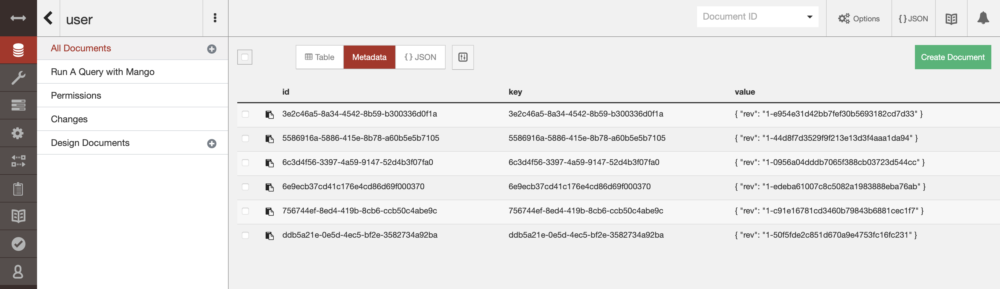
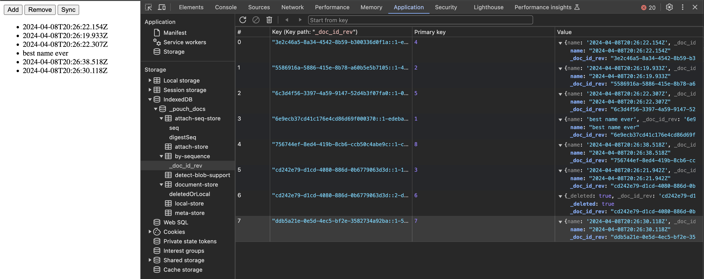

# CouchDB и PouchDB

## Запуск CouchDB

Для запуска воспользуемся [файлом](compose.yml) с помощью `docker-compose`.

## Скачаем PouchDB

Установим с официального сайта `pouchdb.minjs` [здесь](https://pouchdb.com/download.html).

## Добавим данные

Создадим базу с помощью поднятого ui с названием `user`, где будут лежать обьекты с полем `name`.

## Работа приложения

Запустим в браузере [страницу](ДЗ3.html), причем браузер нужно запустить со флагами, чтобы избежать проверки на `CORS`:
- --user-data-dir="/var/tmp/chrome-dev-disabled-security"
- --disable-web-security
- --disable-site-isolation-trials

Тогда будут работать кнопки на странице и можно будет добавлять и удалять элементы из базы данных.

## Остановим CouchDB

После остановки приложение должно продолжать пользоваться данными, которые были полученны после последнего `sync`.

Даже с выключенным сервисом базы данных мы по `sync` получаем данные, так как они лежат в `local storage`.

